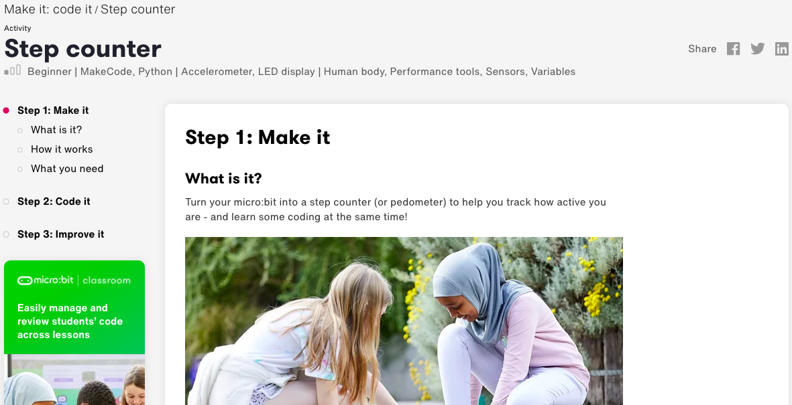
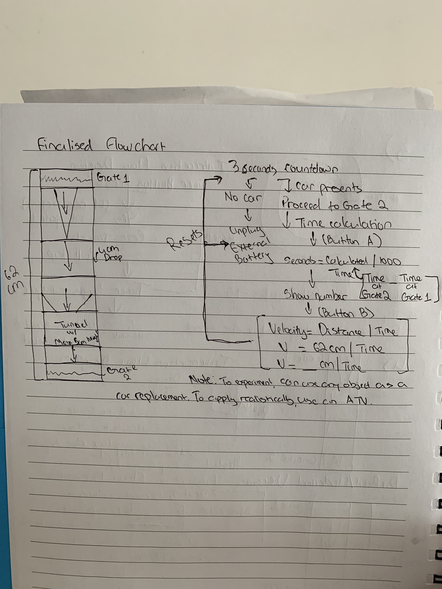
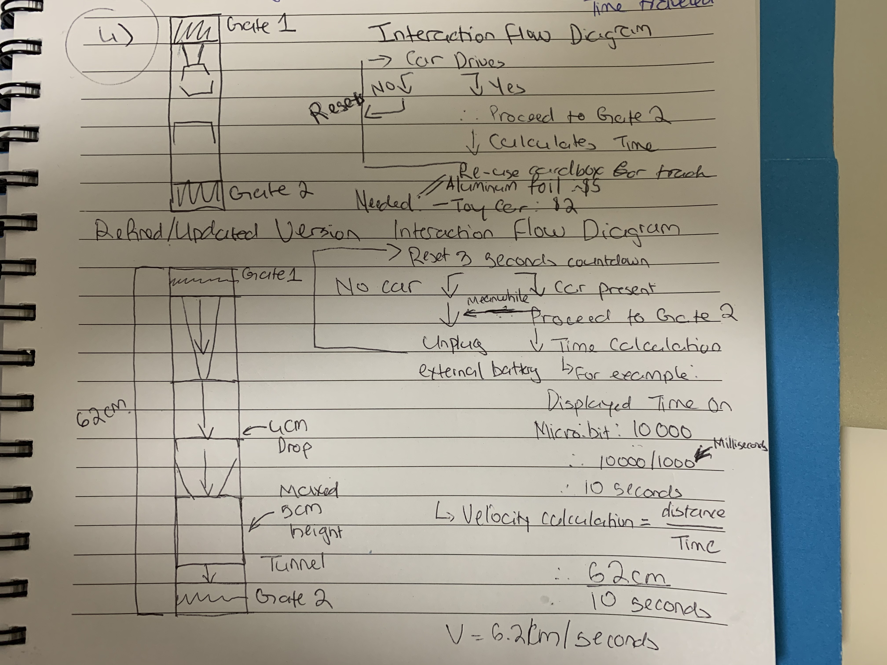
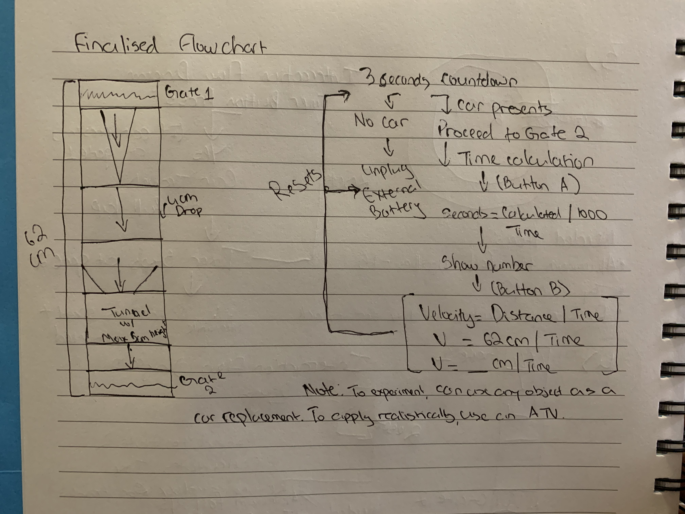
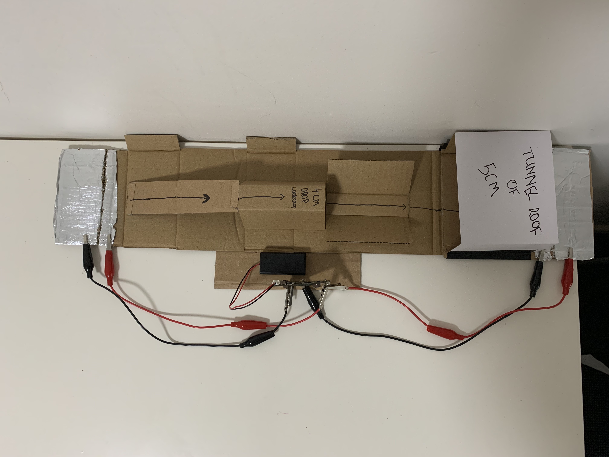
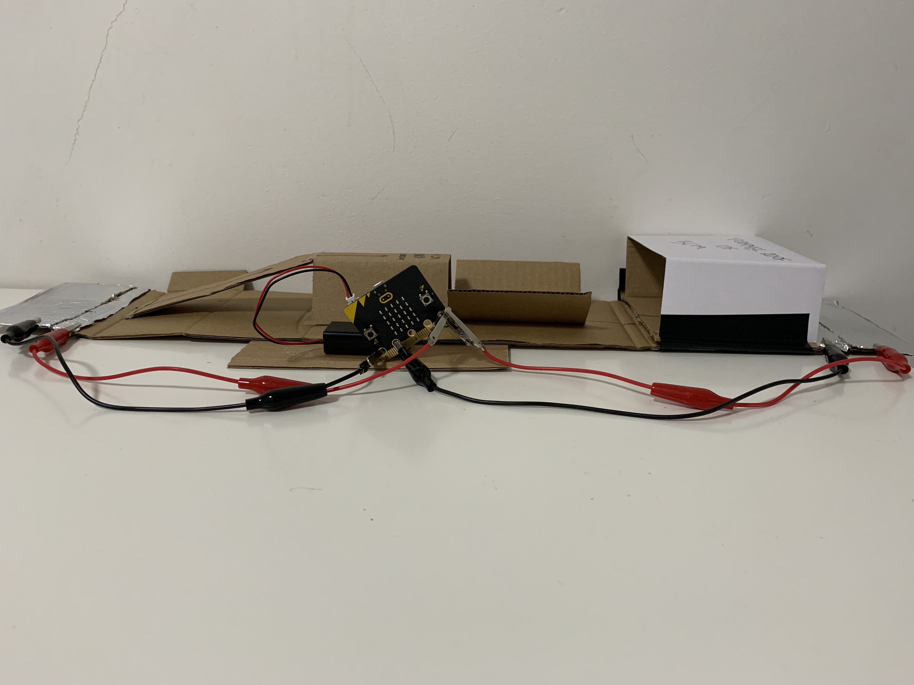

# Assessment 1: Replication project

## Replication project choice ##
Timing Gates 

## Related projects ##

### Related project 1 ###
Step Counter

https://microbit.org/projects/make-it-code-it/step-counter/

Similarly to my project, the Step Counter project allows the person to keep track of a variable - amount of steps for the Step Counter and amount of time for calculating velocity for my project. 

### Related project 2 ###
Reaction Game

https://microbit.org/projects/make-it-code-it/reaction-game/

The mechanics of the reaction game do share several elements, from the cardbox to the aluminum foil. By observing the Reaction Game project, I am able to understand how elements interact together. 

### Related projet 3 ###
Micro:bit Lap Counter For Scalextric Like Track

https://www.kitronik.co.uk/blog/microbit-lap-counter-scalextric/

The layout of this game is related to my project, in the sense that it is fundamentally a track. Both projects require an object - similar to a car and is being timed as they are completing the course. However, the most notable difference between the two projects is that game is calculating the amount of fixed laps, whereas my project calculates the velocity of the car after completing the course. 

### Related project 4 ###
The micro:bit driver // speed

https://thecodecreator.wordpress.com/2017/06/21/the-microbit-driver-speed/

The idea behind this project is as close as my project in terms of the logic and layout. Both projects calculate the speed using a relatively similar forumla. However, this project's final input is in km/h whereas mines is in cm/seconds, and the layout of the project is meant for racing cars whereas mines is more suitable for an atv manufacturer to test their vehicles on unconventional terrains. 

### Related project 5 ###
Kitronik RC Car Hack

https://makecode.microbit.org/projects/rc-car/make

This project can be the substitue for my project's object in a hypothetical scenario, where the scale and the materials of my project is adapted to reality. Here, the controlled RC Car will be scaled simultaneously with the track, allowing the RC Car to maneuver across the course. 

### Related project 6 ###
Obstacle Avoidance with Micro:bit Robit Smart Car

https://www.littlebird.com.au/a/how-to/103/obstacle-avoidance-with-micro-bit-robit-smart-car

This project shares the same logic as my project, however, my project's object (most likely to be a car) maneuvers through a series of obstacles instead of avoding them. 

## Reading reflections ##
### Reading: Don Norman, The Design of Everyday Things, Chapter 1 (The Psychopathology of Everyday Things) ###

Prior in reading the article, I assumed that it would be on the historical developments on a design a typical household object - i.e.: a mobile phone. However, I realised that the reading isn't just about designers and their products, but more about the obstacles and challenges that they had to go through before releasing their products.
By obstacles and challenges I don't mean the difficulties, but more about the refinement of the products. I learned that affordances - referring to the properties of an object and its subsequent capabilities, signifiers - the concept of labeling objects to make them more approachable and understandable, and mapping - laying out how the object's elements interact with each other, are all crucial aspects in the desigining and refinning stages of constructing an object. This will largely benefit my project, as I'm able to adapt to these aspects while I develop aand refine my design. 
This article got me to wonder on the order of adapting these aspects to my project, should it be on delivering the affordances first, then applying the signifiers, and depict a mapping of how my project's elements interact with one another?

### Reading: Chapter 1 of Dan Saffer, Microinteractions: Designing with Details, Chapter 1 ###

I originally presumed the article was based on the concept of having different micro components to build up a larger object, and how the desingers would be "design" the micro components with details. After reading the article, I was proven partly right, as it is in the capabilities of the micro components that allow the users to have microinteractions with the object, however, this can only happen in four stages: the users trigger a command to initiate the microinteraction, the rules and rules' feedbacks will order the command to begin working, and then the loops and modes that determines the meta-rules. In my opinion, this reading will benefit my project, in the sense that it will assist me in establishing my project's logic and any subsequent meta rules. 
The reading got me to wonder whether the Micro:bit would count as a micro component, and thus when interacting with my project, would the users consider the Micro:bit a microinteraction. The logic of this reasoning is due to the fact that the Micro:bit initiate the micro commands for the project to begin, and that the larger components like the crocodile clips and the aluminum foil oversee the duration and completion of the project. 

### Reading: Scott Sullivan, Prototyping Interactive Objects ###

Before reading the article, I predicted the content of the article to be about the desigining proccess of several different prototypes of the same interactive objects. I was proven right, however, the article explores the deeper end of prototype design, including the convientional and non-conventional methods, via the demonstrations of different programming languages, testing stages - including beta testing, and the usage of the Capybara's case study. With this acquired knowledge, I am able to understand the importance of prototyping for my project, and testing different concepts to allow an in-depth comprehensive project. 
As I'm working on my project, I've made several refinements since my original concept using this reading, thus, demostrating the experimenting of different prototypes before I made a final selection. However, like every designers, I wonder how much prototyping on a project is too much, and how much should I be looking at in order for my project to have enough depth.

## Interaction flowchart ##

## Process documentation

The image show my initial ideas for the project, there were four and I chose the fourth one. In my opinion, the fourth one is the closest replicated-yet-original idea for the project. In addition, the image also display the basic structural layout and elements that are crucial for the project, the interaction flow diagram, and the list of essential itineraries for the project.

The image demonstrates my original interaction flowchart and the initial's project layout. As represented, this is a very basic idea, demonstrating that this was during the earlier stages of designing and critiquing my project. 

As I further develop my project, I needed to improve on my interaction flowchart. Here, I provided a velocity calculation system, where as soon as the object (most likey a car) proceeded past Gate 2, the velocity formula (V=Distance/Time) will be configured and the whole project will go into a motion of resetting, an example of the calculation can be visable marked as part of the interaction flowchart. However, if there are no object (most likely a car), the person will unplug the external battery attached to the Micro:bit and the whole project resets.
In addition, my project's map has been improved, clearly indicating the signifiers of the different components and project's measurements are also clearly marked. 

This image represents the chosen interaction flowchart and diagram for my project. This is the closest image to the interaction flowchart as stated above, without the explanation of the calculation for the object's travelled timings. 
## Project outcome ##

### Project title ###

Maneuver Across the Obstacles Timed Track

### Project description ###

The goal of this project is to calculate the most optimal velocity of an all-terrian vehicle to cross a series of obstacles using the distance of the course over time it took to cross. A typical use case would be for an atv vehicle's manufacturer to test their vehicles on challenging terrains, similar to my obstacle course.

### Showcase Image ###

### Additional view ###

### Reflection ###

Assembling the overall track was straightforward, where it became the basic component of my project, thus making it the most successful aspect of the project. However, in terms of the more difficult sides, it would have to be the wiring. I used the crocodile clips as the main source to formulate the circut. Crocodile clips are difficult to connect and can be loosely if their anchor points does not match with what you are trying to clip, thus making the connection somewhat troublesome at first, but, I eventually attached the clips using a Swiss army knife. 

In regards to the possible room for improvements, I would need to find an alternative method to cover the wires and the external battery, as they are still considered loosely. Secondly, as mentioned, I had strategically conducted the 5 Micro:bit experiments that allowed the developments of the project. From the basics like establishing the controlled variables, i.e.: signaling the begin and end of my course, to a dependent variable, i.e.: the crocodile clip is dependent onto the tin foil, to the advance like the coding logic and the declaration of different variables, both were learned during the exploration of related projects. 
Furthermore, in terms of the provided readings, I have collectively learned the following: the importance of experimenting and prototyping in any projects, how it will feed back into the different pre-set meta rules, and the importance in thinking about how the end users will interact with the projects. 
All of these lessons have allowed me to create a robust project, that has the ability to have real world applications. 

Speed limits. If a car travels faster than the speed limit on a set of road, the Micro:bit will be alerted and eventually an authoritative agency will respond. As an extension, the Micro:bit can be pre-set with the maximum speed as the speed limit when coding over a certain distance, thus, will be able to calculate the velocity of the vehicle.
